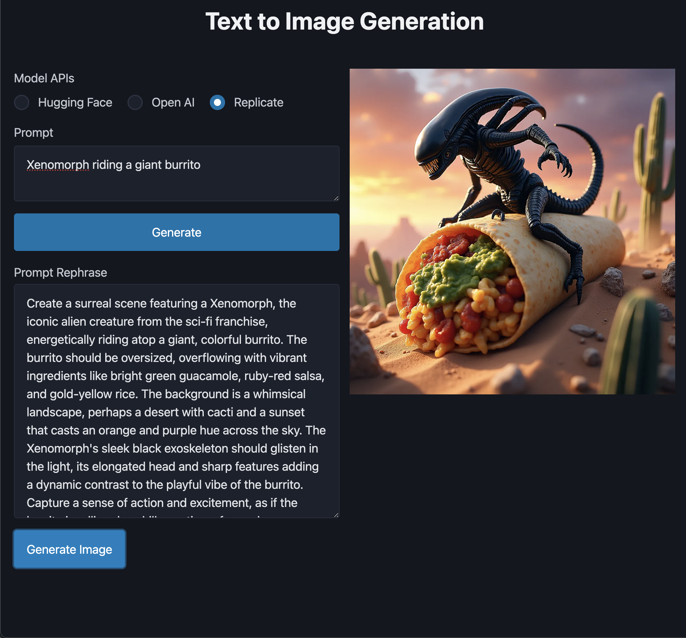

# GEN AI EXPLORATIONS

## About

This repo is an exploration of what's possible with Typescript, Express, and other packages, libraries, and models that might be interesting for Generative AI & JavaScript Development. It's more of a sketch pad to see what's out there. It also makes use of `HTMx` for minimalist server requests and `Twig` templating language for HTML-friendly markup.

# MAIN UI


A simple form with three AI APIs utilizing three different models. 

- `Hugging Face` calls the `stabilityai/stable-diffusion-3-medium-diffusers` model
- `Open AI` calls its own `dall-e-2` model
- `Replicate` calls the `adirik/flux-cinestill` model. 

Each user-provided prompt gets re-written using `OpenAI Chat Completion` and streamed back into the `Prompt Rephrase` input. Authors can choose to re-write the generated prompt or just generate the image. 

Still a WIP but interesting to see what options are out there for building full stack GENAI apps.

To run this locally:

```
git clone git@github.com:edgeq/ts-express-ai.git
npm install
```

You will need to make your own [`.env`](./.env.example) file file with whatever API Tokens you want to to use.

`npm run dev` spins up a local development server. 

Have fun!

> More Projects to Follow... 