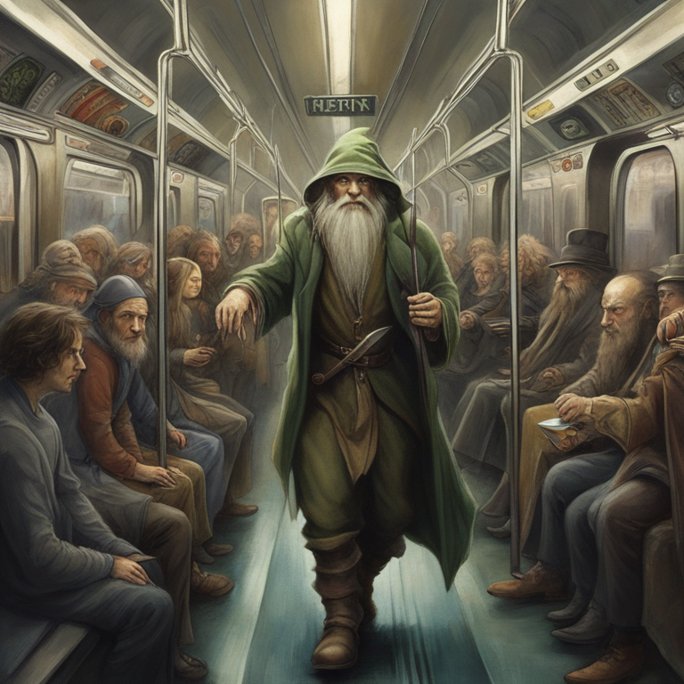
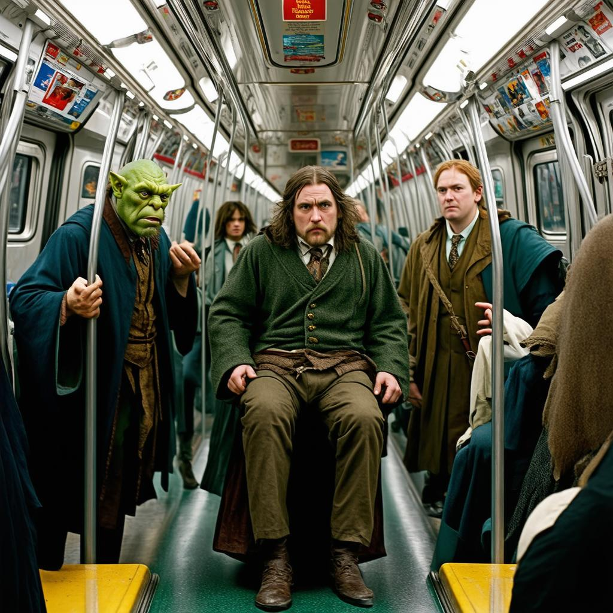

# GEN AI EXPLORATIONS

## About

This repo is an exploration of what's possible with Typescript, Express, and other packages, libraries, and models that might be interesting for Generative AI & JavaScript Development. It's more of a sketch pad to see what's out there. It also makes use of `HTMx` for minimalist server requests and `Twig` templating language for HTML-friendly markup.

> More Projects to Follow... until then, check out this weird image I was able to generate.

## 1 - [OpenAI](src/models/openai.ts)
Uses the OpenAI ChatCompletion (`gpt-4o-mini`) and Image Generation (`dall-e-2`) models to take user input, re-write the prompt, and generate an image.

> Prompt: hobgoblin eating schwarma on a cold night atop skyscrapers. Dark, gritty, and scary aesthetic. Creep me out a little

## 2 - [Replicate](src/models/replicate.ts)
Uses the Replicate API to run various models (`stability-ai/sdxl` and `videocrafter`) for Text-to-Image generation and Text-to-Video generation. Replicate seems to take all the work out of handling generated artifacts and creates files on their server. Handy if you don't want' to 'roll your own' response handling.

> Prompt: Surrealist style, a hobbit from Lord of The Rings riding the subway in a metroplitan city surrounded by other Middle Earth characters. I should see at least one wizard, an Elf, an Ork, and a Dwarf

## 3 - [Hugging Face](src/models/huggingface.ts)
Uses the `@huggingface/inference` api which leaves it to the developer to decide how to process the response.

> Prompt: Surrealist style, a hobbit from Lord of The Rings riding the subway in a metroplitan city surrounded by other Middle Earth characters. I should see at least one wizard, an Elf, an Ork, and a Dwarf

## 4 - [Google Gemini](src/models/gemini.ts)
Uses the `gemini-1.5-flash` model API, which unlike the other model APIs, is strictly dedicated to text generation. Although it is multimodal in that it can analyze media (photo & audio), it is not meant to generate anything other than text. 

Here's it's analysis of the above photo:
> The photo shows a man dressed in a green sweater and brown pants sitting on a subway car. He has a beard and mustache and is looking straight ahead. There is a man in a green robe and a green mask standing to the left of the sitting man. He is holding onto a metal pole, looking to the right.  A man wearing a brown coat and a green shirt and tie is standing to the right of the sitting man. The subway car is crowded with other people and advertisements. The scene is from the movie “The Chronicles of Narnia: The Lion, the Witch, and the Wardrobe”.

Not bad... although it did hallucinate a bit and say the image was from a CS Lewis book and NOT a J.R.R Tolkien book 😜.