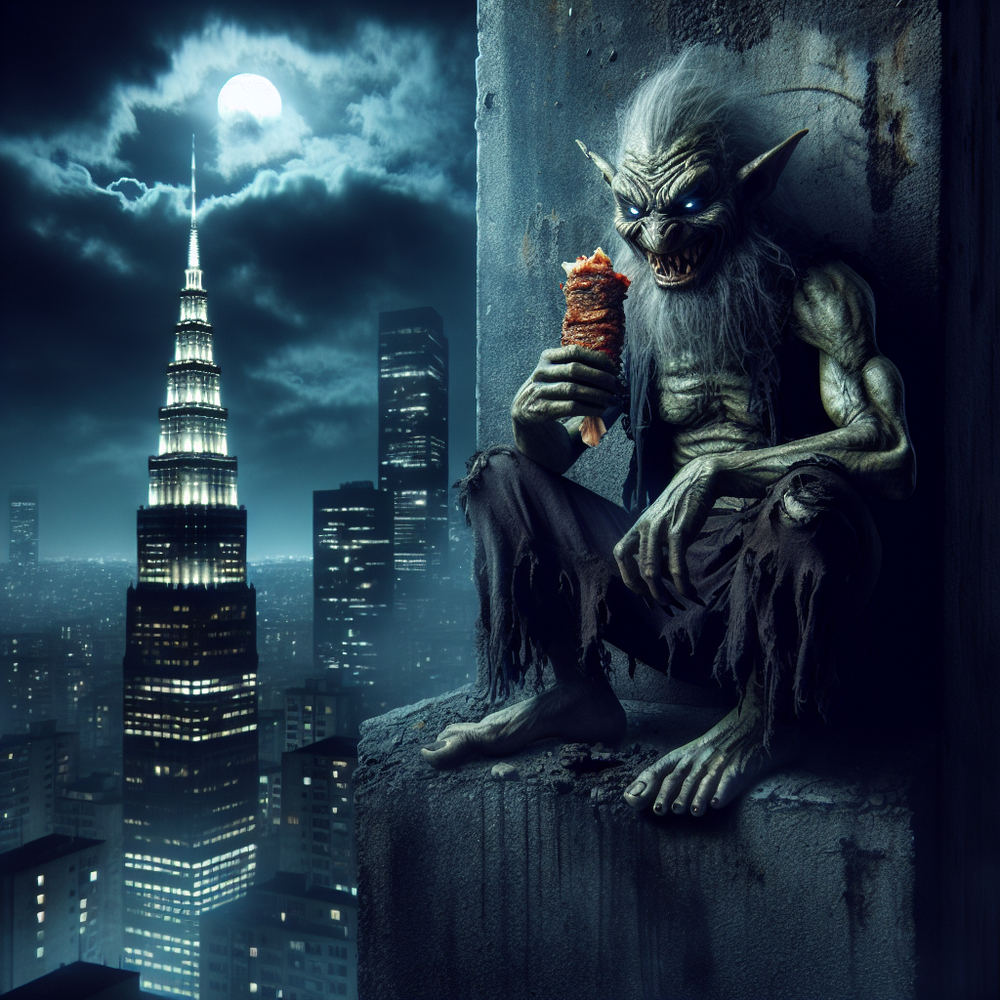

# SERVER EXPLORATIONS

## About

This repo is an exploration of what's possible with Typescript, Express, and other packages that might be interesting for Generative AI & JavaScript Development.

## Project 1
Uses the OpenAI ChatCompletion (`gpt-4o-mini`) and Image Generation (`dall-e-2`) models to take user input, re-write the prompt, and generate an image. It also makes use of `HTMx` for minimalist server requests and `Twig` templating language for HTML-friendly markup.

> More Projects to Follow... until then, check out this weird image I was able to generate.

